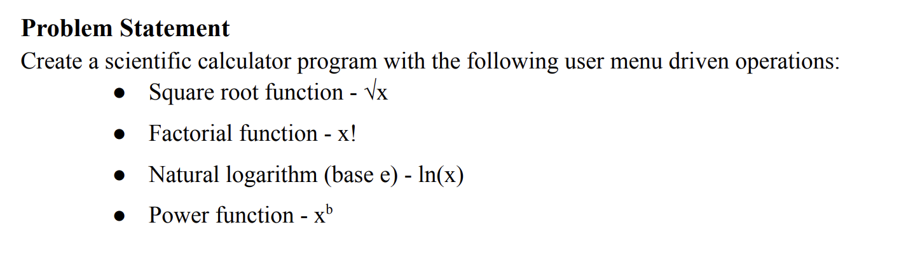
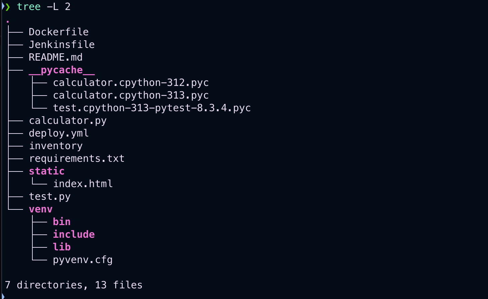
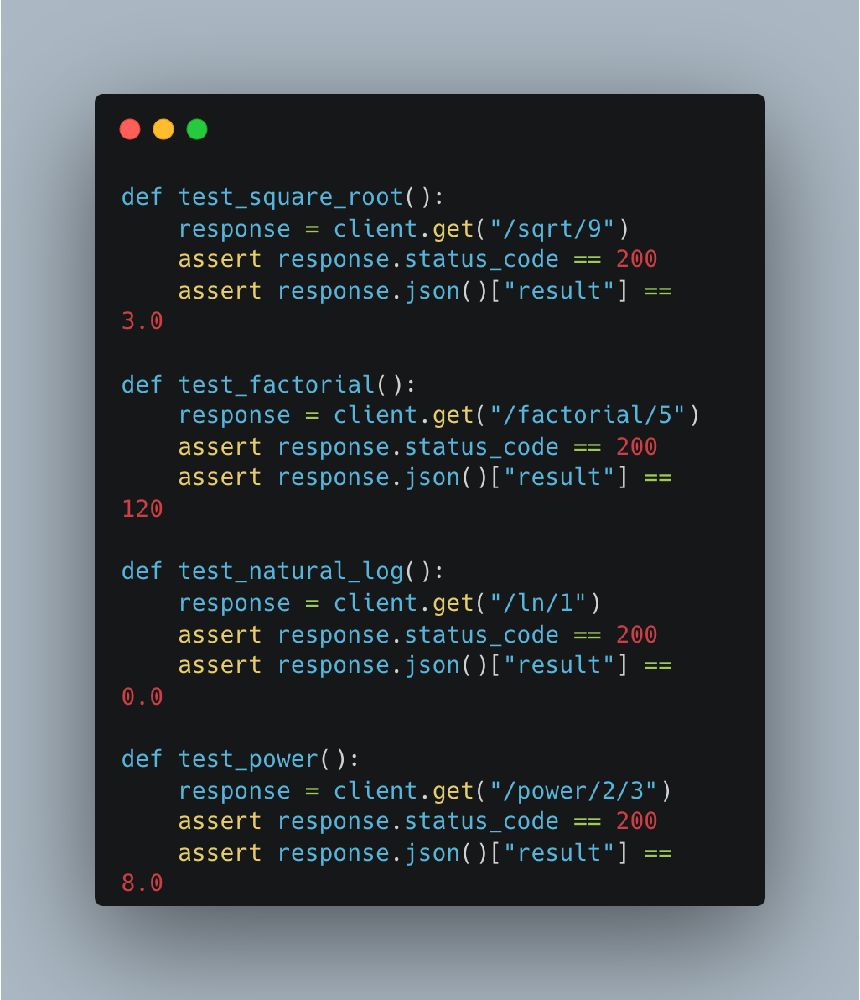
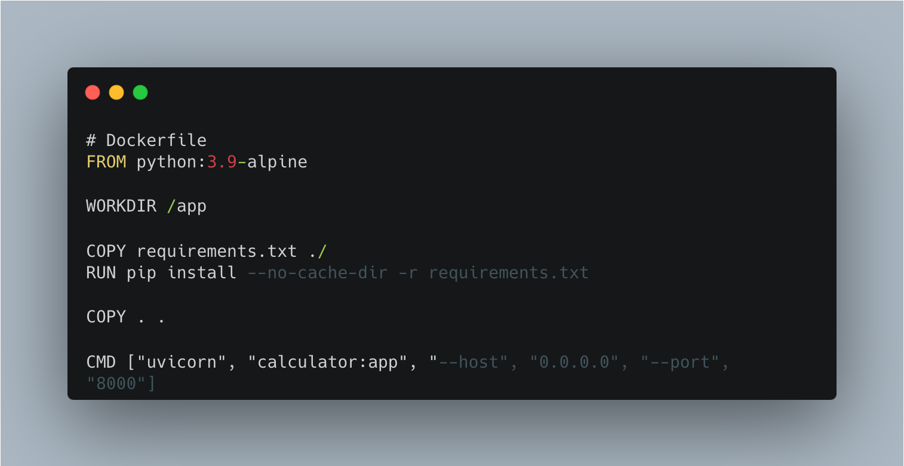
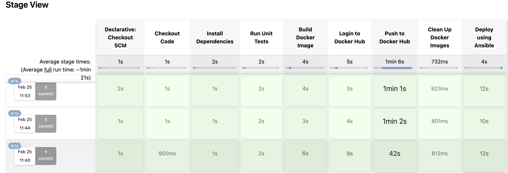

# SPE Miniproject Report

## Done by: MT2024026 Aryan Rastogi


---

## Quick links

- [Github Repo](https://github.com/AryanRastogi7767/Scientific_Calculator.git)
- [Docker image on Dockerhub](https://hub.docker.com/repository/docker/aryan7767/scientific-calculator/general)

---

## Problem statement



More details about the problem statement can be found in [this](./Mini-Project-Scientific-Calculator.pdf) document.

---

## What is DevOps?

DevOps is a **software development and IT operations methodology** that aims to improve **collaboration, automation, and efficiency** in the software delivery process. It integrates **development (Dev)** and **operations (Ops)** teams to enable **continuous integration, continuous delivery (CI/CD), faster releases, and better reliability**.

### Key Principles of DevOps:

1. **Collaboration** – Breaking silos between development and operations.
2. **Automation** – Automating testing, deployment, and infrastructure management.
3. **Continuous Integration & Deployment (CI/CD)** – Frequent code integration and automated deployment.
4. **Monitoring & Feedback** – Real-time tracking of system health and user feedback.
5. **Security (DevSecOps)** – Integrating security practices throughout the pipeline.

---

### Why DevOps?

Traditional software development models (like **Waterfall**) often suffer from **slow deployments, miscommunication, and inefficient workflows**. DevOps addresses these issues by:

1. **Faster Time-to-Market** – Automated pipelines enable quick releases.
2. **Improved Software Quality** – Continuous testing ensures fewer bugs in production.
3. **Greater Scalability & Reliability** – Cloud-native DevOps practices enhance performance.
4. **Better Collaboration** – Developers and IT teams work together seamlessly.
5. **Cost Efficiency** – Reduces manual efforts, downtime, and operational costs.

DevOps is **crucial** in modern **cloud computing, microservices, and AI-driven applications**, ensuring agility and efficiency in software delivery.

**DevOps = Speed + Quality + Reliability!**

---

## Tools used

- **Git**

  - This is a distributed VCS; we used GitHub issues and commits to track the progress of changes made to files.

- **Docker**

  - This is a containerization platform that packages projects into lightweight containers.

- **Ansible**

  - This is a configuration management tool that automates deployment and infrastructure management.

- **Jenkins**

  - This is a CI/CD automation tool that helps automate build, test, and deployment pipelines.

- **Python**

  - The primary programming language used to build the scientific calculator application.

- **FastAPI**

  - A high-performance web framework for building APIs, used to serve the calculator functionalities.

- **Shell Scripting**

  - Used for automating routine deployment and system configuration tasks.

- **Homebrew**
  - A package manager for macOS, used to install dependencies like Docker.

---

## Project structure



#### Root Files

- **Dockerfile** - Defines instructions for building a Docker image.
- **Jenkinsfile** - Specifies CI/CD pipeline steps for Jenkins automation.
- **README.md** - Documentation file explaining the project setup and usage.

#### Source Code & Logic

- **calculator.py** - Main script containing the scientific calculator logic.
- **test.py** - Test script for verifying functionality (probably using `pytest`).

#### Deployment & Automation

- **deploy.yml** - Ansible playbook for automated deployment.
- **inventory** - Ansible inventory file listing target servers.

#### Dependencies

- **requirements.txt** - Lists Python dependencies required for the project.

#### Frontend Files

- **static/** - Contains static web files for the frontend.
  - **index.html** - The HTML file for the web-based calculator UI.

#### Virtual Environment

- **venv/** - Virtual environment for managing Python dependencies.
  - **bin/** - Contains executables and scripts for the virtual environment.
  - **include/** - C header files for compiling Python packages.
  - **lib/** - Installed Python libraries.
  - **pyvenv.cfg** - Configuration file for the virtual environment.

#### Compiled Files (Ignored in Version Control)

- ****pycache**/** - Stores compiled Python bytecode files for faster execution.
  - `calculator.cpython-312.pyc`
  - `calculator.cpython-313.pyc`
  - `test.cpython-313-pytest-8.3.4.pyc`

---

## **Project Overview**

This project follows a well-structured approach to **development, deployment, and automation**:

#### **Development & Testing**

- The core logic is in `calculator.py`, and `test.py` ensures correctness.
- A virtual environment (`venv/`) isolates dependencies.

#### **Automation & Deployment**

- **Jenkins** automates CI/CD pipelines via `Jenkinsfile`.
- **Ansible** manages deployment with `deploy.yml` and `inventory`.

#### **Containerization**

- The `Dockerfile` ensures a portable and reproducible environment.

#### **User Interface**

- The **web-based frontend** is in `static/index.html`.

This structured approach ensures **scalability, efficiency, and automation** in software development.

---

## Code snippets


This Python code defines a simple **FastAPI-based scientific calculator** that provides various mathematical operations as API endpoints. The `@app.get` decorators define routes for different calculations:

- **`/`** → Serves the `index.html` file for the frontend.
- **`/sqrt/{x}`** → Returns the square root of `x`.
- **`/factorial/{x}`** → Returns the factorial of `x`.
- **`/ln/{x}`** → Returns the natural logarithm of `x`.
- **`/power/{x}/{b}`** → Computes `x` raised to the power of `b`.

Each function extracts parameters from the URL, performs the operation using Python’s `math` module, and returns the result as JSON.

---



This Python code contains unit tests for a FastAPI-based scientific calculator using a test client. Each function sends a GET request to an API endpoint and verifies the response:

- **`test_square_root()`**: Checks if `/sqrt/9` returns `3.0`.
- **`test_factorial()`**: Ensures `/factorial/5` returns `120`.
- **`test_natural_log()`**: Tests if `/ln/1` returns `0.0`.
- **`test_power()`**: Verifies `/power/2/3` returns `8.0`.

Each test asserts that:

1. The API response has a **status code of `200`**.
2. The computed result matches the expected value.

---

## 🛠️ Setup and Installation for local machine

#### 1 Clone Repository

```sh
git clone https://github.com/AryanRastogi7767/Scientific_Calculator.git
```

#### 2 Install Dependencies

Before running the application, install the required dependencies:

```sh
pip install -r requirements.txt
```

#### 3 Running the FastAPI Server

Start the application using Uvicorn:

```sh
uvicorn calculator:app --host 0.0.0.0 --port 8000
```

The API will be available at `http://localhost:8000`.

#### 4 Running Tests

To verify the API functionality, run the test suite using **pytest**:

```sh
pytest test.py
```

Test results will be logged in `pytest.log`.

---

## Docker build and run



This is the dockerfile that is used to generate a container with the python file. We can build the image as follows:

```
docker build -t aryan7767/scientific-calculator .
```

This will use the Dockerfile in our directory to create a docker image

It can then be run with

```
❯ docker run -d --name calculator-container -p 8000:8000 aryan7767/scientific-calculator
```

Expose the port 8000 of the container to port 8000 of the local machine. The API will be available at `http://localhost:8000`.

---

## Docker Image to DockerHub

Once the Image is built, we can push it to DockerHub to make it publically accessible.

#### 1 Docker Login

Login into docker.

```
docker login
```

#### 2 Tag the Image

```
docker tag aryan7767/scientific-calculator aryan7767/scientific-calculator:latest
```

#### 3 Push Image to DockerHub

```
docker push aryan7767/scientific-calculator:latest
```

---

## Deploy Using Ansible

#### Prerequisites

- Ansible installed on your local machine
- Docker installed on the target machine
- SSH access to the target machine
- Required Ansible collections installed (`community.docker`)

### Steps to Deploy the Container

#### 1. Set Up Ansible Environment

Ensure Ansible is using the correct Python interpreter:

```yaml
vars:
  ansible_python_interpreter: /Users/aryanrastogi/.ansible-env/bin/python3
```

#### 2. Install Required Ansible Collections

Install the `community.docker` collection:

```yaml
- name: Install required Ansible collections
  ansible.builtin.command: ansible-galaxy collection install community.docker
```

#### 3. Pull the Latest Docker Image

Download the latest version of the scientific calculator Docker image:

```yaml
- name: Pull the latest Docker image
  community.docker.docker_image:
    name: "aryan7767/scientific-calculator"
    source: pull
```

#### 4. Remove Existing Container (if Running)

Ensure no previous instance of the container is running:

```yaml
- name: Remove existing container (if running)
  community.docker.docker_container:
    name: calculator-container
    state: absent
```

#### 5. Deploy the Scientific Calculator Container

Start a new container with the latest image:

```yaml
- name: Run the container
  community.docker.docker_container:
    name: calculator-container
    image: "aryan7767/scientific-calculator:latest"
    state: started
    restart_policy: always
    ports:
      - "8000:8000" # Corrected port mapping for FastAPI
```

---

## Automated Build, Test and Deployment using Jenkins



### 1. Checkout Code

Clones the latest code from the GitHub repository.

```groovy
stage('Checkout Code') {
    steps {
        script {
            git branch: 'main', url: "${GITHUB_REPO_URL}"
        }
    }
}
```

### 2. Install Dependencies

Sets up a Python virtual environment and installs required packages.

```groovy
stage('Install Dependencies') {
    steps {
        sh '''
            python3 -m venv venv
            source venv/bin/activate
            python3 -m pip install --upgrade pip
            python3 -m pip install -r requirements.txt
        '''
    }
}
```

### 3. Run Unit Tests

Executes unit tests using `pytest`.

```groovy
stage('Run Unit Tests') {
    steps {
        sh '''
            python3 -m venv venv
            source venv/bin/activate
            python3 -m pip install --upgrade pip
            python3 -m pip install -r requirements.txt
            pytest test.py --tb=short --disable-warnings
        '''
    }
}
```

### 4. Build Docker Image

Builds a Docker image for the project.

```groovy
stage('Build Docker Image') {
    steps {
        script {
            sh 'docker --version'  // Verify Docker installation
            sh "docker build -t ${DOCKER_IMAGE_NAME} ."
        }
   }
}
```

### 5. Login to Docker Hub

Authenticates with Docker Hub using Jenkins credentials.

```groovy
stage('Login to Docker Hub') {
    steps {
        withCredentials([usernamePassword(credentialsId: env.DOCKER_CREDENTIALS_ID, usernameVariable: 'DOCKER_USERNAME', passwordVariable: 'DOCKER_PASSWORD')]) {
            sh '''
                echo "$DOCKER_PASSWORD" | docker login -u "$DOCKER_USERNAME" --password-stdin
            '''
        }
    }
}
```

### 6. Push Docker Image to Docker Hub

Tags and pushes the Docker image to the repository.

```groovy
stage('Push to Docker Hub') {
    steps {
        script {
            sh "docker tag ${DOCKER_IMAGE_NAME} ${DOCKER_TAG}"
            sh "docker push ${DOCKER_TAG}"
        }
    }
}
```

### 7. Clean Up Docker Images

Removes old Docker images to free space.

```groovy
stage('Clean Up Docker Images') {
    steps {
        sh "docker rmi ${DOCKER_TAG} || true"  // Remove old images
        sh "docker rmi ${DOCKER_IMAGE_NAME} || true"
    }
}
```

### 8. Deploy Using Ansible

Deploys the containerized application using Ansible.

```groovy
stage('Deploy using Ansible') {
    steps {
        sh 'ansible-playbook -i inventory deploy.yml'
    }
}
```

## Deployment Complete 🎉

The scientific calculator container is now up and running! We can access it at `http://localhost:8000`.
